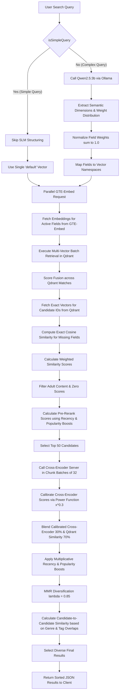

# Anima Semantic Search Architecture

The `/api/semantic-search` endpoint implements a highly advanced, multi-vector semantic search pipeline. It leverages a combination of a Small Language Model (SLM) for query parsing, parallel multi-vector embeddings, vector database batch search, exact score fusion, Cross-Encoder reranking, and Maximal Marginal Relevance (MMR) diversification.

---

## Pipeline Overview Diagram

The diagram below illustrates the detailed flow of a search request from query input to final results:

---

## Step-by-Step Architecture Details

### 1. Query Classification (`isSimpleQuery`)
Each inbound query is classified as **Simple** or **Complex** to minimize resource overhead:
*   **Simple Query**: A query containing at most 3 non-stopword content words, or containing only known genre/category terms. Simple queries bypass LLM structuring and proceed directly using a single vector search against the `default` (synopsis/metadata) index.
*   **Complex Query**: Natural language queries specifying plot elements, characters, actions, or themes (e.g., *"smart student carries a death book"*).

### 2. SLM Structuring (via Ollama)
For complex queries, Qwen 2.5 (3B parameters) is invoked locally to dissect the query into multiple semantic sub-spaces. The model populates a structured JSON schema:
*   `strict_relationships`: SVO (Subject-Verb-Object) triples to preserve actions and grammatical relationships.
*   `core_concepts`: Overarching narrative themes.
*   `character_archetypes`, `conflict_types`, `power_systems`, `strategic_elements`, `philosophical_elements`, `world_elements`.
*   **Dynamic Weighting**: The SLM assigns relative importances (weights) to each active field depending on the user's intent. These weights are normalized to sum exactly to `1.0`.

### 3. Parallel Embedding Generation (GTE-Embed)
For each active field, the query text is sent in parallel to the local **GTE-Embed** server (`http://localhost:8080/embed`) to generate dense, high-dimensional vector representations.

### 4. Multi-Vector Batch Search (Qdrant)
The query vectors are mapped to their corresponding named vector namespaces in the Qdrant database:
*   `strict_relationships` ➔ `default` vector namespace.
*   Other fields ➔ corresponding named namespaces (`core_concepts`, `conflict_types`, etc.).
Qdrant performs a batch search to retrieve up to 500 candidate documents per vector.

### 5. Exact Score Fusion & Cosine Dot Products
*   A document may appear in only one search branch's top results, leaving scores for other active fields missing.
*   To prevent missing scores from artificially lowering a document's average relevance, the system fetches the exact vectors for all unique candidate IDs from Qdrant in a single round-trip.
*   A custom manual dot-product cosine similarity is calculated between the query vectors and the document vectors for all missing fields.
*   The final fused similarity score is a weighted average based on the SLM-assigned normalized weights.

### 6. Pre-Ranking & Filtering
Candidates are filtered (excluding zero-scores and 18+ titles if `filterAdult` is enabled). A lightweight pre-rerank score is calculated:
$$\text{Pre-Rerank Score} = \text{Vector Similarity} \times (1.0 + \text{Popularity Boost} + \text{Recency Boost})$$
The top 50 candidates are selected to pass to the heavy Cross-Encoder reranker.

### 7. Cross-Encoder Reranking
*   The top 50 candidates are sent to the local **Cross-Encoder Reranker** (`http://localhost:8082/rerank`).
*   Requests are chunked in batches of 32 to avoid HTTP payload limitations.
*   The query and formatted semantic descriptions (`Title | Description | Core Concepts`) are compared.
*   **Calibration**: The Cross-Encoder outputs conservative sigmoidal values. The system applies a power calibration ($x^{0.3}$) to stretch the dynamic range for better UI contrast.
*   **Blending**: The final relevance score blends the calibrated Cross-Encoder score (30%) and Qdrant vector similarity (70%), followed by multiplicative boosts prioritizing recency (0.5 weight) and popularity (0.1 weight).

### 8. MMR Diversification (Maximal Marginal Relevance)
To prevent search results from being dominated by sequels, prequels, or highly similar series, MMR is applied with $\lambda = 0.85$:
$$\text{MMR Score} = \lambda \times \text{Relevance} - (1 - \lambda) \times \text{Similarity to Selected}$$
*   **Candidate-to-Candidate Similarity** is measured via a Jaccard overlap index based on genres and tags.
*   The result is a highly diverse, relevant, and engaging list of anime search results.

---

## System Dependencies

*   **Ollama**: Local LLM runner hosting `qwen2.5:3b` at `http://localhost:11434`.
*   **Embedding Server**: GTE-Embed (e.g., Tei/Local) at `http://localhost:8080/embed`.
*   **Vector Database**: Qdrant running at `http://localhost:6333`.
*   **Cross-Encoder Reranker**: Reranker server running at `http://localhost:8082/rerank`.
